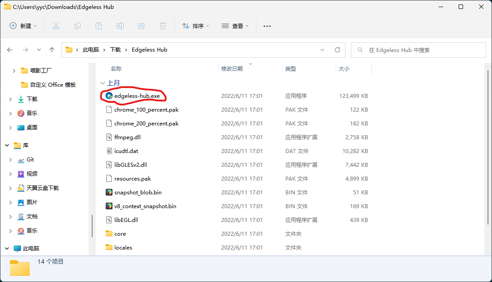
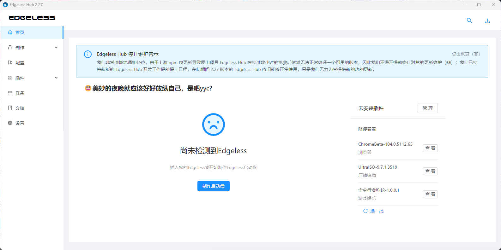
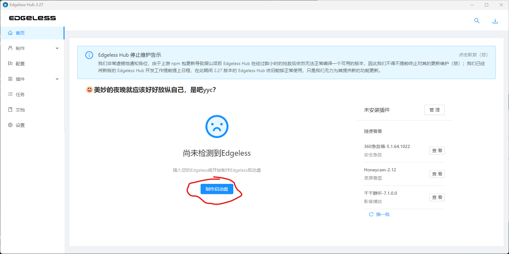

# 大概了解了软件之后，是时候开始了解如何解决日常中的问题了

我们这里不会教Windows的日常使用，因为这玩意应该人人都会

这里只教必要的维护性操作与技巧

__注意：本节中内容除特别说明外都应在Windows下操作！！__
## 创建一个Windows PE维护环境

用人话来说，就是一个在系统打不开时用来修电脑的东西。更加完整的解释看[这里](https://wiki.edgeless.top/v2/faq/whats.html)

这里推荐使用 [Edgeless PE](https://home.edgeless.top/)

点[这里](https://down.edgeless.top/)下载

下载好之后，我们就来实际操作一下。

使用压缩软件解压下载下来的压缩包，推荐7-zip [官网](https://www.7-zip.org/) [中文站](https://sparanoid.com/lab/7z/)

解压完之后找到解压好的文件，一般在 /存放下载文件的地方/Edgeless Hub 中

找到edgeless-hub.exe，并打开。

如果一切正常。应该会看到这个画面

插入一个大小不少于64G的U盘，在U盘成功加载后跟屏幕指示操作

__此操作会清空U盘上的全部数据，务必当心！__

推荐安装一些维护用工具，比如分区助手，DiskGenius，DISM++，以及Office等用来应急的日常工具，任君挑选。
