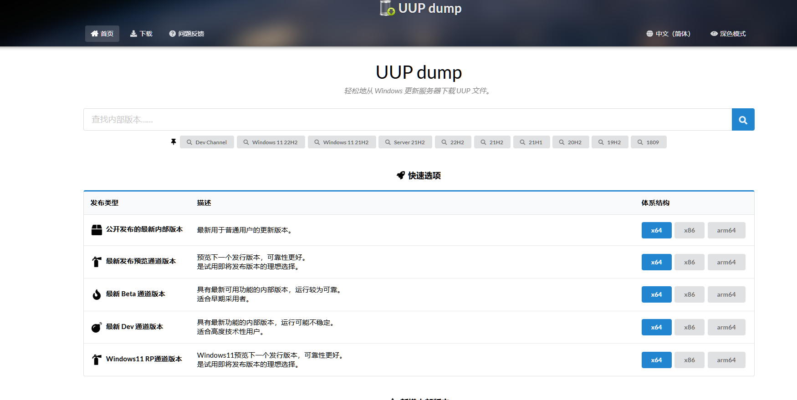
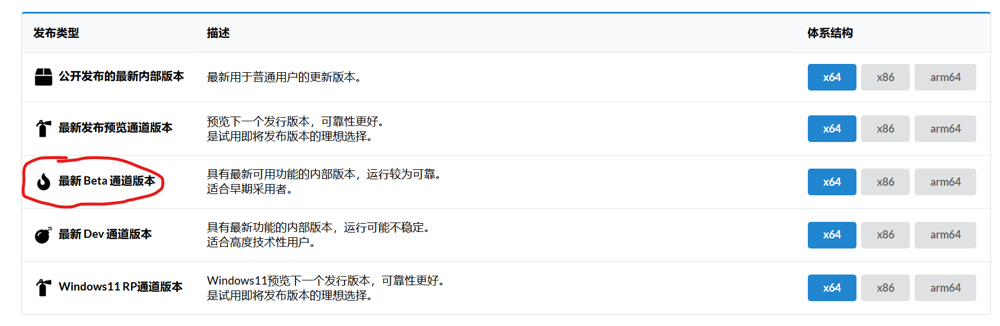
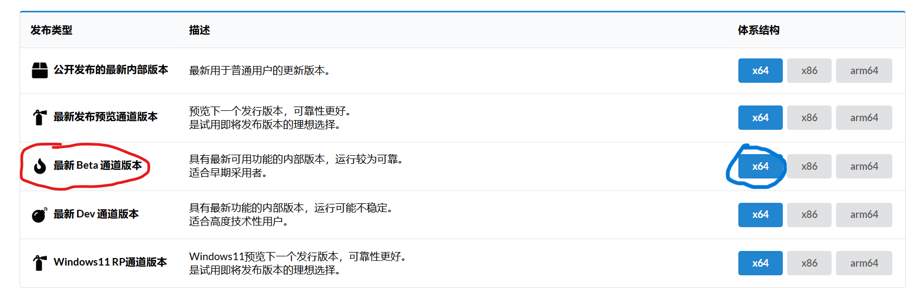

# 大概了解了软件之后，是时候开始了解如何解决日常中的问题了

我们这里不会教Windows的日常使用，因为这玩意应该人人都会

这里只教必要的维护性操作与技巧

__注意：本节中内容除特别说明外都应在Windows下操作！！__
## 创建一个Windows PE维护环境

用人话来说，就是一个在系统打不开时用来修电脑的东西。更加完整的解释看[这里](https://wiki.edgeless.top/v2/faq/whats.html)

这里推荐使用 [Edgeless PE](https://home.edgeless.top/)

点[这里](https://down.edgeless.top/)下载

下载好之后，我们就来实际操作一下。

使用压缩软件解压下载下来的压缩包，推荐7-zip [官网](https://www.7-zip.org/) [中文站](https://sparanoid.com/lab/7z/)

解压完之后找到解压好的文件，一般在 /存放下载文件的地方/Edgeless Hub 中

找到edgeless-hub.exe，并打开。

如果一切正常。应该会看到这个画面

插入一个大小不少于64G的U盘，在U盘成功加载后跟屏幕指示操作

__此操作会清空U盘上的全部数据，务必当心！__

推荐安装一些维护用工具，比如分区助手，DiskGenius，DISM++，以及Office等用来应急的日常工具，任君挑选。

## 未雨绸缪，系统镜像下载

首先，我们已经备份了一个系统，放置在名称为EMERGENCY的分区中（这个分区平常看不见，需要给其分配驱动器号）使用DISM++即可还原（这点在下一节会讲）但出于系统安装后的更新时间考虑，您可能会想下载一个新版本系统的镜像。跟着我们一块走吧。

下载镜像推荐使用itellyou和UUP DUMP

这里我们介绍后者

[UUP DUMP原版网站](https://www.uupdump.net)在国外，且下载文件的速度欠佳，所以我们使用一位远景大佬搭建的[镜像站](https://www.uupdump.cn)（如果无法正常访问，点击[这里](https://uup.pc521.net)）

在这个站点上，你可以用他们提供的脚本来下载UUP（一系列系统更新的文件）并将它们转化为ISO系统镜像

所有的文件都从微软官方获取

___注意！不是所有的UUP文件都能正常转化为ISO，并且有些UUP文件是给微软的云服务Azure用的，不要随便进行安装或用DISM部署！___

进入站点后，我们按照以下步骤操作

确定我们需要的镜像版本，在我们系统更新的需求里应当选择“最新Beta通道版本”

我们的白板的架构是x86_64，所以选择x64那个按钮

进入之后，这个网站会自动帮你筛选出最新的完整功能更新包

但是，这里的更新包版本不一定是最新的，有些小功能更新不会被筛选，所以，如果这里展示出的更新包版本比当前系统还低，或者有更新的功能更新（版本号的第三个小数点后数字有变化）

Windows10&11的版本号格式如下（以目前的最新公开发布版为例）

Windows10：10.0.19044.1889
Windows11：10.0.22000.917

这里的版本号仅作格式参考

请参考IT之家等消息源的最新Beta版版本号进行下载

这里就以UUP筛选出的最新版为例

点击你想使用的版本号

选择语言，默认应该就是中文简体，然后直接点击下一步

在版本处勾选“Windows Pro”这一项，然后选择下一步。

在下一个页面的下载方式处选中最后一项“使用aria2下载、转换并创建其他版本”

在选择其他版本处只保留“Windows Pro Education”和“Windows Education”这两项

在转换选项处勾选“使用 install.esd 而非 install.wim 创建 ISO”，这样可以减小生成的镜像的大小。

然后点击创建下载包

解压下载好的文件，双击“uup_download_windows.cmd”
然后坐和放宽

这个过程大约需要45分钟到一个小时，期间的部分操作对磁盘和CPU占用较大，请在确认不会影响正常教学后操作，或在家里的电脑上生成好镜像后再拷到班级白板后使用

如果Windows目前无法使用，用之前创建的PE维护环境也可以生成ISO，当然，用我安装的Manjaro Linux也行，我会在之后的Manjaro教程中叙述

## 用DISM++这把瑞士军刀备份和还原系统

[DISM++](https://github.com/Chuyu-Team/Dism-Multi-language)是一个功能十分强大的工具，这里只讲述系统备份与还原功能

___由于DISM++已经很久没有更新过了，（上次更新还是在去年8月）可能存在一些bug，请慎用其中的功能！___

DISM++的优势在于，原本使用DISM需要敲一长串命令才能执行的操作，现在点两下就可以解决

从[Github Release](https://github.com/Chuyu-Team/Dism-Multi-language/releases)获取最新版本。由于Github不挂ladder下载速度拉跨，请考虑使用代理一类的服务下载（我才不会告诉你其实我已经准备了，当然在后面我会给你解释的）

